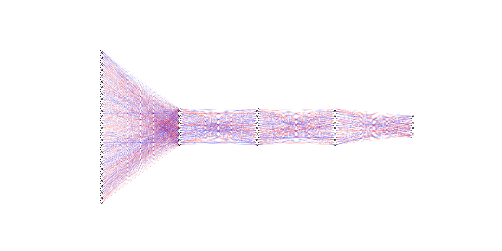
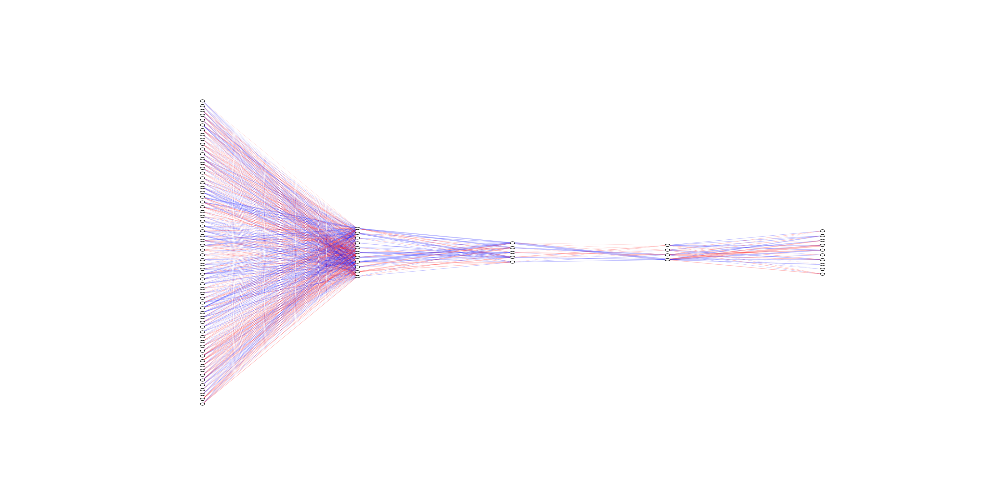

# Three ways to prune a neural network 

### Example of pruning with skeletonization (node-based pruning)

* Before: 

* After: 


### Try it out locally

```
git clone git@github.com:riveSunder/pruning_tutorial.git
cd pruning_tutorial
virtualenv my_env --python=python3.8
source my_env/bin/activate
pip install -e .
git checkout 6e1bd3f7f152c5daf547beb95ccf13635f737692

python src/train.py
```

### Cloud notebook demos

* On mybinder.org: [https://mybinder.org/v2/gh/riveSunder/pruning_tutorial/HEAD?labpath=notebooks%2Fpruning_demo.ipynb](https://mybinder.org/v2/gh/riveSunder/pruning_tutorial/HEAD?labpath=notebooks%2Fpruning_demo.ipynb)
* On Kaggle: [https://www.kaggle.com/rivesunder/pruning-demo](https://www.kaggle.com/rivesunder/pruning-demo)
* On Google Colab: [https://colab.research.google.com/github/riveSunder/pruning_tutorial/blob/master/notebooks/pruning_demo.ipynb](https://colab.research.google.com/github/riveSunder/pruning_tutorial/blob/master/notebooks/pruning_demo.ipynb)
